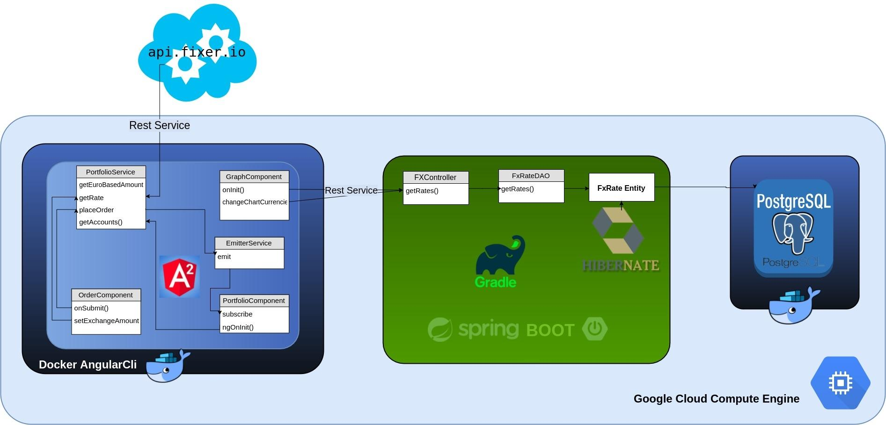

# Forex Trading Platform Demo with Angular 2

http://35.186.178.180

# How to set it up?

# First install Docker (I used ubuntu OS)

sudo apt install docker.io

sudo gpasswd -aG mike docker

sudo service docker restart

newgrp docker

#then pull a docker container with angular-cli installed

docker pull alexsuch/angular-cli

# How to run the docker container and start up the angular 2 whiteapp 

docker run -it --rm -w /app -v $(pwd):/app alexsuch/angular-cli ng new angular-demo

docker run -it --rm -w /app -v $(pwd)/angular-demo:/app alexsuch/angular-cli ng g component demo-component

docker run -it --rm -w /app -v $(pwd)/angular-demo:/app -p 4200:4200 alexsuch/angular-cli ng serve --host 0.0.0.0

# How to get into docker container

C=$(docker run -i -d alpine sh)
docker exec -it $C sh

docker exec -it $containerId sh

# How to generate classes, components 

ng generate class Account --spec

ng generate component portfolio

# How to install additional npm librairies like angular2 highcharts
# Need all those libraries for project to compile

npm install  @angular/cdk@2.0.0-beta.8 --save

npm install  @angular/common@4.2.6 --save

npm install  @angular/core@4.2.6 --save

npm install  @angular/platform-browser@4.2.6 --save

npm i @angular2-material/core

npm install whatwg-fetch --save

npm i hammerjs

npm install hammerjs --save-dev

npm install @types/hammerjs --save-dev

npm install md-data-table

npm install ng2-currency-mask --save

npm install @angular/forms --save

npm install angular2-highcharts --save

npm install @material/drawer --save

# AngularDemo

This project was generated with [Angular CLI](https://github.com/angular/angular-cli) version 1.1.3.

## Development server

Run `ng serve` for a dev server. Navigate to `http://localhost:4200/`. The app will automatically reload if you change any of the source files.

## Code scaffolding

Run `ng generate component component-name` to generate a new component. You can also use `ng generate directive|pipe|service|class|module`.

## Build

Run `ng build` to build the project. The build artifacts will be stored in the `dist/` directory. Use the `-prod` flag for a production build.

## Running unit tests

Run `ng test` to execute the unit tests via [Karma](https://karma-runner.github.io).

## Running end-to-end tests

Run `ng e2e` to execute the end-to-end tests via [Protractor](http://www.protractortest.org/).
Before running the tests make sure you are serving the app via `ng serve`.

## Further help

To get more help on the Angular CLI use `ng help` or go check out the [Angular CLI README](https://github.com/angular/angular-cli/blob/master/README.md).

# Demo at
http://35.186.178.180